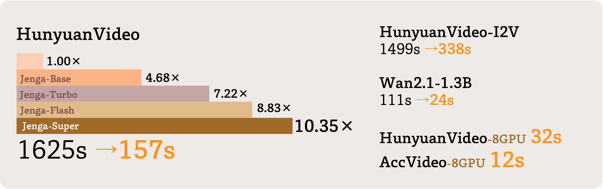

<p align="center">
  
</p>


<div align="center">
  <a href="https://julianjuaner.github.io/projects/jenga"></a> &ensp;
  <a href="https://arxiv.org/abs/2505.16864"></a> &ensp;
  <a href="https://huggingface.co/papers/2505.16864"></a> &ensp;
</div>

> The offical implementation of the paper [**Training-Free Efficient Video Generation via Dynamic Token Carving**](https://arxiv.org/abs/2505.16864) <be>
## Overview
Jenga can generate videos with 4.68-10.35 times faster on single GPU.
<p align="center">
  
</p>

Please visit the [project page](https://julianjuaner.github.io/projects/jenga) for more video results.

<p align="center">
  
</p>

---------

## Open-source Plan

- Model Adaptation
  - [x] HunyuanVideo Inference 
  - [x] Multi-gpus Parallel inference (Faster inference speed on more gpus)
  - [x] HunyuanVideo-I2V Inference
  - [x] Wan2.1-1.3B
  - [x] Wan2.1-14B (I2V [not tested yet], T2V)
- Engineering Optimization
  - [ ] Quantization (sage-attention)
  - [ ] ComfyUI
  - [ ] RoPE & Norm Kernel
  - [ ] FA3 Adaptation

## Guidance

### Inference on HunyuanVideo

#### Enviornment
Following the installation as in HunyuanVideo:
```shell
# 1. Create conda environment
conda create -n Jenga python==3.10.9

# 2. Activate the environment
conda activate Jenga

# 3. Install PyTorch and other dependencies using conda
# For CUDA 12.4
conda install pytorch==2.4.0 torchvision==0.19.0 torchaudio==2.4.0 pytorch-cuda=12.4 -c pytorch -c nvidia

# 4. Install pip dependencies
python -m pip install -r hy_requirements.txt

# 5. Install flash attention v2 for acceleration (requires CUDA 11.8 or above)
python -m pip install ninja
python -m pip install git+https://github.com/Dao-AILab/flash-attention.git@v2.6.3

# 6. Install xDiT for parallel inference (we test on H800, cuda124)
python -m pip install xfuser==0.4.3.post3
python -m pip install yunchang==0.6.3.post1
```
#### Download model
Please following the instruction in [model_down_hy.md](./utils/model_down_hy.md).

#### Single GPU Inference
```shell
bash scripts/hyvideo_jenga_base.sh # Jenga Base (Opt. 310s)
# bash scripts/hyvideo_jenga_turbo.sh # Jenga Turbo
# bash scripts/hyvideo_jenga_flash.sh # Jenga Flash
# bash scripts/hyvideo_jenga_3stage.sh # Jenga 3Stage 
```
Inference time for different settings (DiT time, single H800, after warmup): 
|HunyuanVideo| Jenga-Base | Jenga-Turbo | Jenga-Flash | Jenga-3Stage |
| ----| ---- | ---- | ---- | ---- |
|1625s| 310s (5.24x) | 225s (7.22x) | 184s (8.82x)| 157s (10.35x)| 

If you want to type your prompt directly, just change the `--prompt`. Following command (for Jenga-Turbo)
> If you encounters OOM issue, try to add `--use-cpu-offload`.

```shell
CUDA_VISIBLE_DEVICES=0 python3 -u ./jenga_hyvideo.py \
    --video-size 720 1280 \
    --video-length 125 \
    --infer-steps 50 \
    --prompt "A cat walks on the grass, realistic style." \
    --seed 42 \
    --embedded-cfg-scale 6.0 \
    --flow-shift 7.0 \
    --flow-reverse \
    --sa-drop-rates 0.7 0.8 \
    --p-remain-rates 0.3 \
    --post-fix "Jenga_Turbo" \
    --save-path ./results/hyvideo \
    --res-rate-list 0.75 1.0 \
    --step-rate-list 0.5 1.0 \
    --scheduler-shift-list 7 9
```

#### Multi GPU Inference
We provide set of 8GPU runnable scripts (further 5-6x compared with single GPU):
```shell
bash scripts/hyvide_multigpu_jenga_base.sh 
# bash scripts/hyvide_multigpu_jenga_turbo.sh 
# bash scripts/hyvide_multigpu_jenga_flash.sh 
# bash scripts/hyvide_multigpu_jenga_3stage.sh 
```
For customizing (Jenga-Turbo as example):
```shell
export NPROC_PER_NODE=8
export ULYSSES_DEGREE=8 # number of GPU

CUDA_VISIBLE_DEVICES=0,1,2,3,4,5,6,7 torchrun --nproc_per_node=$NPROC_PER_NODE ./jenga_hyvideo_multigpu.py \
    --video-size 720 1280 \
    --video-length 125 \
    --infer-steps 50 \
    --prompt "The camera rotates around a large stack of vintage televisions all showing different programs -- 1950s sci-fi movies, horror movies, news, static, a 1970s sitcom, etc, set inside a large New York museum gallery." \
    --seed 42 \
    --embedded-cfg-scale 6.0 \
    --flow-shift 7.0 \
    --flow-reverse \
    --sa-drop-rates 0.75 0.85 \
    --p-remain-rates 0.3 \
    --post-fix "Jenga_Turbo" \
    --save-path ./results/hyvideo_multigpu \
    --res-rate-list 0.75 1.0 \
    --step-rate-list 0.5 1.0 \
    --ulysses-degree $ULYSSES_DEGREE \
    --scheduler-shift-list 7 9
```
Inference time for different settings (DiT time, 8xH800, after warmup): 
|HunyuanVideo| Jenga-Base | Jenga-Turbo | Jenga-Flash | Jenga-3Stage |
| ---- | ---- | ---- | ---- | ---- |
| 225s | 55s (4.09x)| 40s (5.62x) | 38s (5.92x) | 32s (7.03x) | 

#### Run Multiple Samples with Multi-GPU
Due to the constant time of VAE, we recommend allocating each prompt to a single card for batch sampling. Please check the sample script in Jenga-Turbo.
```shell
bash ./scripts/hyvideo_batched_sample.sh
```
---------
### Inference on AccVideo (Distilled Models)
The general pipeline is the same, just download weight from [Huggingface](https://huggingface.co/aejion/AccVideo) to `ckpts/AccVideo`

Then run the script
```shell
bash ./scripts/accvideo_jenga.sh
```
---------
### Inference on HunyuanVideo-I2V
First, download HunyuanVideo-I2V models following the [instruction](./utils/model_down_hyi2v.md)

Here we support single prompt inference and json-like input (for example, VBench-like input)
```shell
bash ./scripts/hyi2v_jenga_base.sh
```
If you want to input json files for batched inference, please format your file as following:
```json
[
  {
        "prompt_en": "a close up of a blue and orange liquid, camera pans left",
        "dimension": [
            "camera_motion"
        ],
        "image_type": "abstract",
        "image_name": "a close up of a blue and orange liquid.jpg",
        "id": "0001"
    },
    {
        "prompt_en": "a close up of a blue and orange liquid, camera pans right",
        "dimension": [
            "camera_motion"
        ],
        "image_type": "abstract",
        "image_name": "a close up of a blue and orange liquid.jpg",
        "id": "0002"
    },
]
```
We test on the default case: 1088x832x125f, 113K tokens, following is a reference DiT time:

|HunyuanVideo| Jenga-Base | 
| ---- | ---- | 
| 1590s | 323s (4.92x)|

---------
### Inference on Wan2.1
Currently, we support Wan2.1-1.3B. We are working on the 14B inference.
We use the same environment as in Hunyuan, please update enviorment if you find trouble in env setup, please refer to the official guideline in [Wan2.1](https://github.com/Wan-Video/Wan2.1).

First, download Wan2.1 models from HuggingFace [Wan2.1 1.3B](https://huggingface.co/Wan-AI/Wan2.1-T2V-1.3B), [Wan2.1 14B](https://huggingface.co/Wan-AI/Wan2.1-T2V-14B) to `./ckpts`

We support Jenga-Base and Jenga-Turbo, you may also adjust the `--teacache_thresh` or use **complex rewritten prompts** to resolve possible temporal flickering problem.

```shell
bash ./scripts/wan_1.3B_jenga_base.sh
# bash ./scripts/wan_1.3B_jenga_turbo.sh
# bash ./scripts/wan_14B_jenga_base.sh
# bash ./scripts/wan_14B_jenga_turbo.sh
```
For Wan 1.3B, we test on the default case: 832x480x81f, 32K tokens, following is a reference DiT time (FlashAttention2):
|Wan2.1-1.3B| Jenga-Base | Jenga-Turbo | 
| ---- | ---- | ---- | 
| 111s | 26s (4.26x) | 18s (6.16x)| 

For Wan 14B, **we introduced a decoupled first-frame block selection to eliminate the first-frame artifact**. We test on the default case: 1280x720x81f, following is a reference DiT time (FlashAttention2):
|Wan2.1-14B| Jenga-Base | Jenga-Turbo | 
| ---- | ---- | ---- | 
| 1807s | 438s (4.12x) | 295s (6.12x)| 

## Method Overview
The general idea of Jenga is to reduce token interactions in Diffusion Transformers (DiTs). Following is an overview.
<p align="center">
  
</p>

*The left part* illustrates the attention carving. A 3D video latent is partitioned into local blocks before being passed to the Transformer layers. A block-wise attention is processed to get a head-aware sparse block-selection masks. In each selected block, dense parallel attention is performed. *The right part* illustrates the Progressive Resolution strategy. The number of tokens and timesteps is compressed to ensure an efficient generation.

<br>

<p align="center">
  
</p>

**Attention Carving (AttenCarve).** Here we illustrate a toy example of a 4x4x4 latent, where m=8 latent items form a block. *Left:* The latent 3D re-ordering and block partition via space filling curves (SFC). *Right:* After the block-wise attention, we can construct the Importance Mask, combined with the pre-computed Condition Mask and Adjacency Mask, a block-wise dense attention mask is passed to the customized kernel for device-efficient attention.

<br>

<p align="center">
  
</p>

**Progressive Resolusion (ProRes).** *Left:* A brief illustration of stage switch and timestep skip. Before the rescale in stage s, we revert the latent to a clean state $\hat{x}^{s}_0$, then re-noise on the upsampled clean latent. *Right & Bottom:* We add a bias on the video-text attention score, to enable a scalable Field of View (FOV) in low-resolution content generation.

<br>

## Citation
If you find [Jenga](https://arxiv.org/abs/2505.16864) useful for your research and applications, please cite using this BibTeX:

```BibTeX
@article{zhang2025training,
  title={Training-Free Efficient Video Generation via Dynamic Token Carving},
  author={Zhang, Yuechen and Xing, Jinbo and Xia, Bin and Liu, Shaoteng and Peng, Bohao and Tao, Xin and Wan, Pengfei and Lo, Eric and Jia, Jiaya},
  journal={arXiv preprint arXiv:2505.16864},
  year={2025}
}
```

## Acknowledgements

We would like to thank the contributors to the [HunyuanVideo](https://github.com/Tencent/HunyuanVideo), [HunyuanVideo-I2V](https://github.com/Tencent-Hunyuan/HunyuanVideo-I2V), [Wan2.1](https://github.com/Wan-Video/Wan2.1), [AccVideo](https://github.com/aejion/AccVideo), [MInference](https://github.com/microsoft/MInference), [Gilbert](https://github.com/jakubcerveny/gilbert), [TeaCache](https://github.com/ali-vilab/TeaCache) and [HuggingFace](https://huggingface.co) repositories, for their open research and exploration.